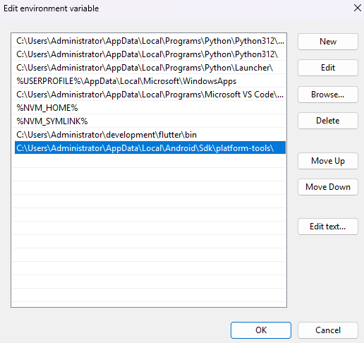

# Get Started

## Flutter Download
<b>first setup flutter(for windows+android): </b><a href='https://docs.flutter.dev/get-started/install/windows/mobile'>Flutter for windows</a>
<p>In that link read their documentation and Under <b>'Install the Flutter SDK' > 'Use VS Code to install'</b>. Launch your vscode and go market place install <b>'Flutter'</b> and <b>'Dart'</b> packages.
</p>

## Android Studio
<p>First, clearly read their requirements. <a href="https://developer.android.com/studio/install"> installation doc</a>.</p>
<b>Download Android Studio: </b><a href='https://developer.android.com/studio/index.html'>Download exe file page</a>
<p>Now, Download the file.</p>

## Setup flutter & Android Studio:

### Flutter

<p> The documentation here properly guide you to install <a href='https://docs.flutter.dev/get-started/install/windows/mobile'>Flutter for windows</a>. So, I do not need to explain it. </p>

### Android Studio

Navigate where you downlaod the `.exe` file. Now, run it as administrator. keep them as default. Ok, take times to install.then keep settings in default and click finish and wait for installation, if installation process is crashed then pop up comes click retry. wait for complete then everything is done `Finish` button will available click it. Remeber that retry will pop up multiple times if your network is slow. Then close all. You can restart your pc. After that, search android studio and open it.<br>

Now go to `More Action` > `SDK Manager`. It will open Android SDK window go `SDK Tools` Tab then check those three: `Android SDK Command-line Tools(latest)`, `NDK`, `cMake` and click apply accept the term and the install will complete soon. Ok, now go `SDK platforms` this is optional but `sometimes you face some errors. So, try to check some platforms which have new api levels like 31, 32, 34, and 35`. click apply and install them. But if you face still have errors while development! then AI will guide you what you need. ok, I'm going to close it here.

## Environment Path

If you know how to setup `PATH` environment actually you have to know it. Now, open the `android stuido` > `More option` > `SDK Manager`. Here you will see the Android SDK Location in my case it looks like this: `C:\Users\Administrator\AppData\Local\Android\Sdk` copy it and open `edit enviornment variable for your account` by searching in launcher :) and go path under `user variable for someone` then `Edit` > `New` > `paste` which you copied earlier. But one folder to add. just see this image you will understand:<br>

 <br>

Ok and Ok and save and close it. Now, close all your terminals. Then open terminal agin compelete the license agrement:

```powershell
flutter doctor --android-licenses
```

Check the all are done:

```bash
flutter --version; dart --version; adb version # or # adb --version
```

## Connect Your Android phone while development (wireless + windows + vscode):

Following those commands:

```bash
adb pair <ip_address>:port_number # from pop up
```
It will need the pairing code so enter your pairing code. Now, close the pop up of pair device with pairing code. You will also see "IP address & Port" section.

```bash
adb connect <ip_adress>:port_number # from IP addresss & Port section
```

Check the connection with adb command:

```bash
adb devices
```
Also, with flutter command:

```bash
flutter devices
```
Check the debug mode is working:

```bash
flutter run
```

## References:

1. <a href='https://docs.flutter.dev/get-started/install'> Flutter Download </a><br>

2. <a href='https://docs.flutter.dev/'> Flutter Documentation </a><br>

3. <a href='https://developer.android.com/studio/index.html'> Android Studio Documentation</a><br>

4. <a href='https://dart.dev/language'> Dart Documentation </a>

5. <a href='https://pub.dev/'> Flutter Package Repositories</a>
