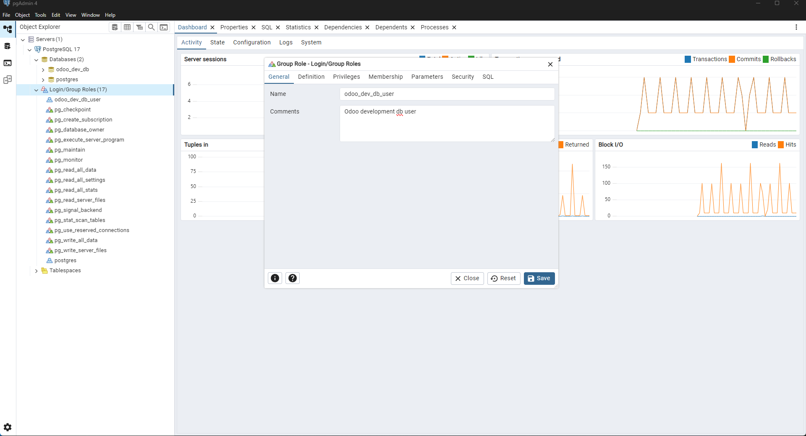
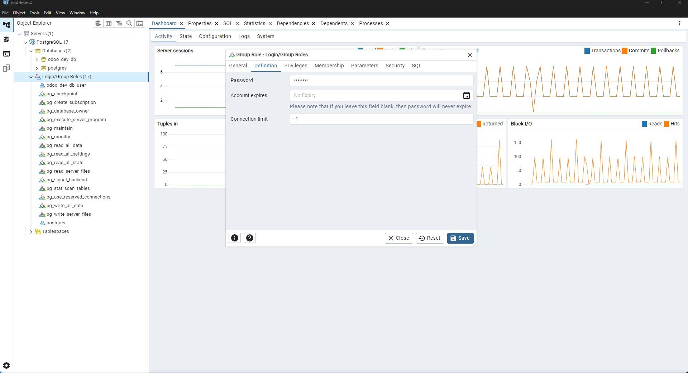
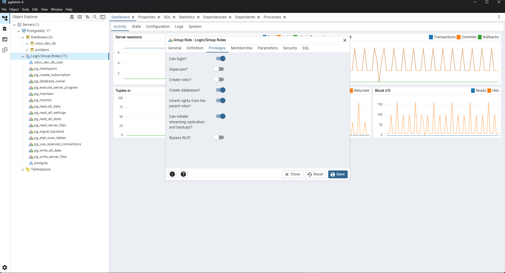
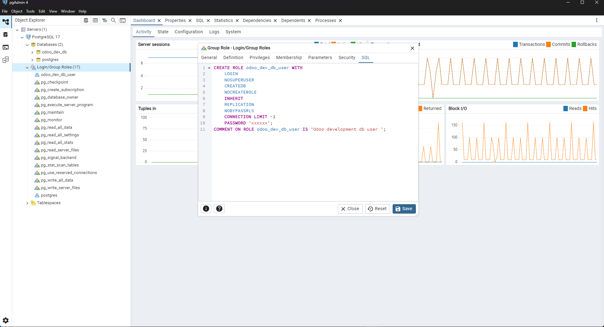

# Description

Setup odoo developement on (vscode+windows)

# Requirements

1. Postgresql

2. Python 3.12+ (make sure you install stable python version)


## Setup

1. Install <a href="https://www.postgresql.org/download/windows">Postgresql.org</a>.

2. Install <a href="https://visualstudio.microsoft.com/visual-cpp-build-tools/">Visual C++ Build Tools</a>.
    <ul>
     <li>Check the box for <b>"Desktop development with C++".</b></li>
     <li>Make sure to select MSVC v14.x+ build tools.</li>
     <li>Windows 10/11 SDK selected (any newer version)</li>
     <li>C++ CMake tools for Windows (optional but often useful)</li>
    </ul>
3. Clone <a ref="https://github.com/odoo/odoo">Odoo GitHub repository</a>.

4. open powershell and go to `odoo` directory

```powershell
cd odoo
```

5. Create virtual environment

```powershell
python -m venv env
```

6. Activate virtual environment.

```powershell
env\Scripts\activate
```

7. install additonal dependencies

```powerhshell
pip install setuptools wheel
```

8. Install <a href="https://wkhtmltopdf.org/downloads.html">Wkhtmltopdf.org</a>.

9. Now, back to the terminal and install requirements for odoo

```powershell
pip install -r requirements.txt
```

10. Now, we create a database user for odoo. So, open `pgadmin4`

11. Then expand `Servers` give your password which we give while install that postgresql.

12. You will see a `Login/Group Roles`. Right click on it and go `create` then `Login/Group Role..`.

13. follow those image instructions. Note that, user name and passwords are on your choice.

  <ul>
    <li>Give name</li>
    </img>
    <li>Set password</li>
    </img>
    <li>Set user permission</li>
    </img>
    <li> Go SQL tab for final check</li>
    </img>
  </ul>

14. Save it and close the `pgadmin4` app.

15. Now, go back to terminal.

16. Create `odoo.conf` file and create `custom_addons` folders

 ```powershell
 mkdir custom_addons
 ```

 ```powershell
 notepad odoo.conf
 ```

 17. Now, paste those lines

 ```config
[options]
addons_path = addons,custom_addons
db_host = localhost
db_port = 5432
db_user = place_your_odoo_database_user
db_password = place_your_odoo_database_pass
admin_passwd = admin
logfile = odoo.log
http_port = palce_custom_port_number_you_can_remove_it_if_you_want_to_continue_with_default
```
&nbsp;&nbsp;&nbsp;&nbsp;&nbsp;&nbsp;&nbsp;&nbsp;&nbsp;&nbsp;&nbsp;
<b>Note:</b> you can avoid http_Port option. Also, you can put custom db_port if you need it. Here, I use 5432, which is default and 8069 is default port for odoo but I add a custom one so I add that.

18. Now, save and close the file.

19. Now, open vscode with odoo directory.

```powershell
code odoo
```

20. Open terminal of vscode activate `env/Scripts/activate`.

20. Before, we run the test all setup are ok. make sure you activate virtual environment and postgresql is running.

```powershell
get-service -Name "postgresql*"
```
or,

```powershell
Get-Service -Name "postgresql*" | Select-Object Name, Status, StartType
```

21. First, check your setup is ok.

```powershell
python odoo-bin -c odoo.conf
```

22. Now, check the `odoo.log` file. If you don't see any issues. Then, go to the browser and type `localhost:8069` or `localhost:custom_port`.

23. Ok again check the log file, for run time error. If everything is fine your almost done.

24. For development now create `.vscode` directory inside `odoo` directory. Then in `.vscode` create `launch.json` file. Then copy and paste those line in that file.

```json
{
    "version": "0.2.0",
    "configurations": [
      {
        "name": "Run Odoo",
        "type": "debugpy",
        "request": "launch",
        "program": "odoo-bin",
        "args": ["--config=odoo.conf", "--dev=reload,xml", "--dev=all"],
        "cwd": "${workspaceFolder}"
      }
    ]
  }
```

25. What it will do, it just save your debugging time.

26. Happy coding! :)