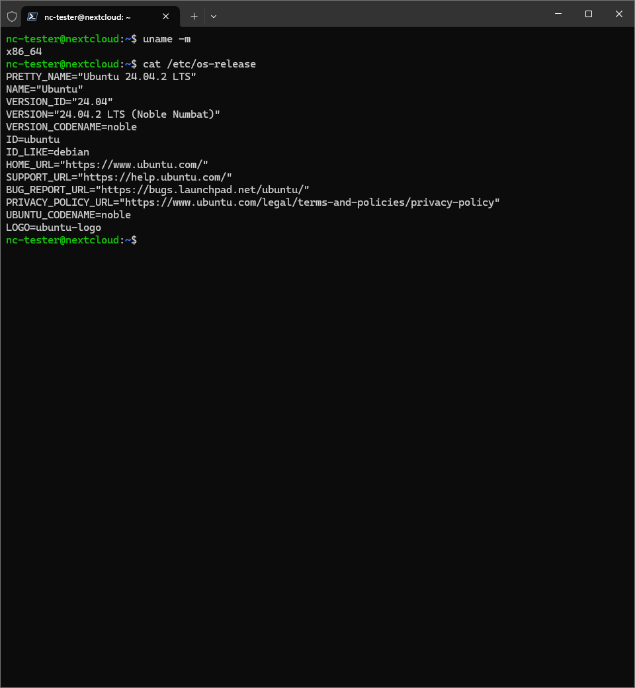

## Get Started

1. System update:

```bash
sudo apt update && sudo apt upgrade -y
```

2. Install dependencies

```bash
sudo apt install python3 python3-pip python3-dev python3-venv \
                 build-essential libjpeg-dev libpq-dev libxml2-dev \
                 libxslt1-dev libldap2-dev libsasl2-dev libffi-dev \
                 libssl-dev libjpeg-dev libblas-dev libatlas-base-dev \
                 libopenjp2-7-dev -y
```

3. Install PostgreSQL (Database)

```bash
sudo apt install postgresql -y
```

4. Start and enable service:

```bash
sudo systemctl start postgresql
sudo systemctl enable postgresql
```

5. Install Wkhtmltopdf

First, check your pc architecture and code name of your pc:

| Architecture      | Common Names/Equivalent Terms       | Usage Context                            | Notes                                                                 |
|--------------------|--------------------------------------|------------------------------------------|-----------------------------------------------------------------------|
| **i386**           | x86, IA-32, x86_32                   | Legacy 32-bit x86 systems                | Original 32-bit Intel architecture (80386). Mostly obsolete today.   |
| **x86_64**         | AMD64, x64, Intel 64                 | Modern 64-bit x86 systems                | 64-bit extension of x86 (backward-compatible with i386).             |
| **IA-64**          | Itanium                              | Server/enterprise systems                | Intel’s non-x86 64-bit architecture (unrelated to x86_64/AMD64).     |
| **ARMv7**          | armhf, armv7l, armel (soft-float)    | 32-bit ARM devices (e.g., Raspberry Pi)  | 32-bit ARM architecture. "armhf" = hard-float optimized.             |
| **AArch64**        | ARM64, armv8, arm64                  | 64-bit ARM devices (e.g., Apple Silicon) | Modern 64-bit ARM architecture. Linux uses `arm64`, Debian `aarch64`.|
| **RISC-V**         | RV32 (32-bit), RV64 (64-bit)         | Embedded systems, experimental hardware | Open-source RISC architecture.                                       |
| **MIPS**           | mips (32-bit), mips64 (64-bit)       | Routers, embedded systems                | Common in networking hardware.                                       |
| **PowerPC**        | ppc (32-bit), ppc64/ppc64le (64-bit) | Older Macs, IBM servers, consoles        | `ppc64le` = Little-endian (e.g., IBM POWER systems).                 |

To, do that type those following command

```bash
uname -m
```

Here, check the architecture from the given list check the `Common Names/Equivalent Terms` for better understanding, and now type that command given below:

```bash
cat /etc/os-release
```

You will see like that,

</img>

You need the `VERSION_CODENAME` and `ID`. Sometimes you did not able to see the `VERSION_CODENAME` is not found in the relase list <a href="https://github.com/wkhtmltopdf/packaging/releases/tag/0.12.6.1-3"> here</a>. So, you just collect the latest release which suit for you.

Ok, now visit that <a href="https://github.com/wkhtmltopdf/packaging/releases/tag/0.12.6.1-3"> link </a>, chose your package. and right-click on it copy link go back to terminal and then type:

```bash
wget https://github.com/wkhtmltopdf/packaging/releases/download/0.12.6.1-3/wkhtmltox_0.12.6.1-3.jammy_amd64.deb # link maybe different as per your end. 
```

```bash
# wait for download then type
sudo dpkg -i wkhtmltox_0.12.6.1-3.jammy_amd64.deb
```

```bash
# solve the installation error
sudo apt isntall -f
```

```bash
# then complete the installation
sudo dpkg -i wkhtmltox_0.12.6.1-3.jammy_amd64.deb
```

6. Create odoo database user

```bash
sudo -u postgres createuser -s odoo
```

7. Create odoo user in system

```bash
sudo useradd -m -d /opt/odoo -U -r -s /bin/bash odoo
```

8. Switch to odoo user

```bash
sudo su - odoo
```

9. Clone odoo repository:

```bash
git clone https://www.github.com/odoo/odoo --branch 18.0 --depth=1 # change branch according to newer version check github offical repo
```

10. Create virtual environment install dependencies

```bash
exit
```

```bash
apt install python3.12-venv # must be as root user
```

```bash
sudo su - odoo
```

```bash
cd odoo
python3 -m venv venv
source venv/bin/activate
pip install -r requirements.txt
```

11. Confing Odoo

```bash
sudo nano /etc/odoo.conf
```

add those lines:

```ini
[options]
admin_passwd = admin
db_host = False
db_port = False
db_user = odoo
db_password = False
addons_path = /opt/odoo/odoo/addons
logfile = /var/log/odoo.log
```

then press `Ctrl+S` and then `Ctrl+X` 

12. Create Systemd Service

```bash
sudo nano /etc/systemd/system/odoo.service
```
add those lines:

```ini
[Unit]
Description=Odoo ERP
After=network.target postgresql.service

[Service]
User=odoo
Group=odoo
ExecStart=/opt/odoo/odoo/venv/bin/python3 /opt/odoo/odoo/odoo-bin -c /etc/odoo.conf
Restart=always

[Install]
WantedBy=multi-user.target
```

then press `Ctrl+S` and then `Ctrl+X` 

13. Reload service and enable it

```bash
sudo systemctl daemon-reload
sudo systemctl enable --now odoo
```

14. check the service status

```bash
sudo systemctl status odoo
```

15. Final setp (access odoo):
<p> http://< your-server-ip >:8069 </p>


## Enable Firewall

1. Make sure you have also access to the ssh

```bash
sudo ufw allow 22/tcp
```

2. Access for odoo:

```bash
sudo ufw allow 8069/tcp
```

3. Enable

```bash
sudo ufw enable
```

another setup

1. access postgre sql:

```bash
nano .bashrc # if your in /root directory
```

```bash
alias postg='sudo -u postgres psql'
```
then press `Ctrl+S` and then `Ctrl+X` 

## Troubleshooting 

--> Clear Database

```bash
postg
```

Check which database used by odoo user

```bash
\l
```

Now wirte that in you terminal

here odoo in last two line should be changed according to your database name listed in `\l` command
```bash
SELECT pg_terminate_backend(pg_stat_activity.pid)
FROM pg_stat_activity
WHERE pg_stat_activity.datname = 'odoo';
DROP DATABASE odoo;
```

## For odoo Devlopment

1. Create odoo user like this

```bash
sudo su - postgres
```

```bash
psql
```

```bash
CREATE ROLE db_username WITH LOGIN NOSUPERUSER CREATEDB NOCREATEROLE INHERIT REPLICATION NOBYPASSRLS CONNECTION LIMIT -1 PASSWORD 'db_user_pass';
COMMENT ON ROLE odoo_dev_db_user IS 'give you description here'
```

2. Check user is created.

```bash
\du+
```

# Ref:

Odoo github: `https://github.com/odoo/odoo`